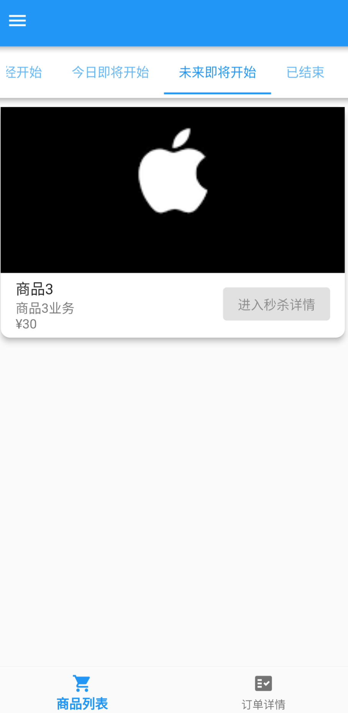
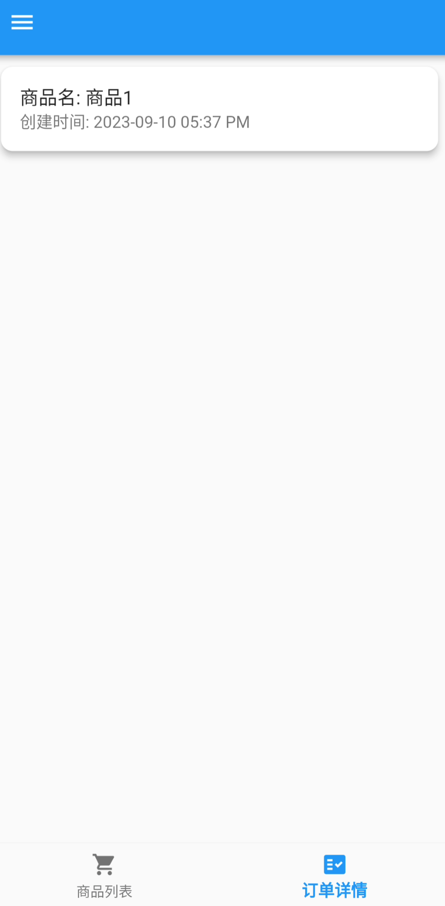
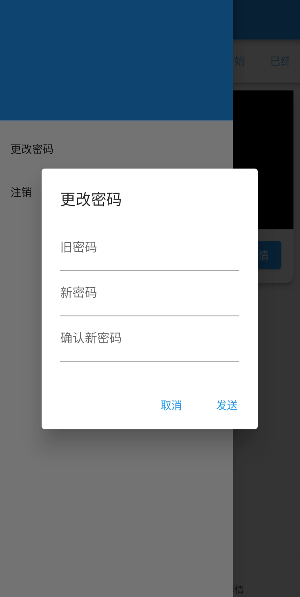

# 简介

用flutter来写的秒杀应用。

这是 [秒杀应用后端](https://github.com/weiraneve/seckillcloud)
的mobile端，这里还有[秒杀应用的web端](https://github.com/weiraneve/seckill-front)
，以及[后台配置的web端](https://github.com/weiraneve/admin-manager)

## 界面和功能

- 登录页面

- 注册界面

- 商品列表界面

- 商品详情界面

- 修改密码界面

## 技术栈
包括但不仅限于:
- 项目很多功能基于[GetX](https://pub.dev/packages/get)，如依赖注入、路由管理、状态管理(controller)等功能。
- 网络部分-[Dio](https://pub.dev/packages/dio) + [retrofit](https://pub.dev/packages/retrofit) +
  [json_serializable](https://pub.dev/packages/json_serializable)的组合。
- 环境变量-[flutter_dotenv](https://pub.dev/packages/flutter_dotenv)
- MVVM-[provider](https://pub.dev/packages/provider)
- local storage存储token-[flutter_secure_storage](https://pub.dev/packages/flutter_secure_storage)

# 其他
如果把后端项目启动之后，设置好的测试账号和密码分别是`12345678910` 和 `123`。因为没有暂时没给客户端加上登录和注册的国密算法，所以没有加盐加密传输的逻辑。