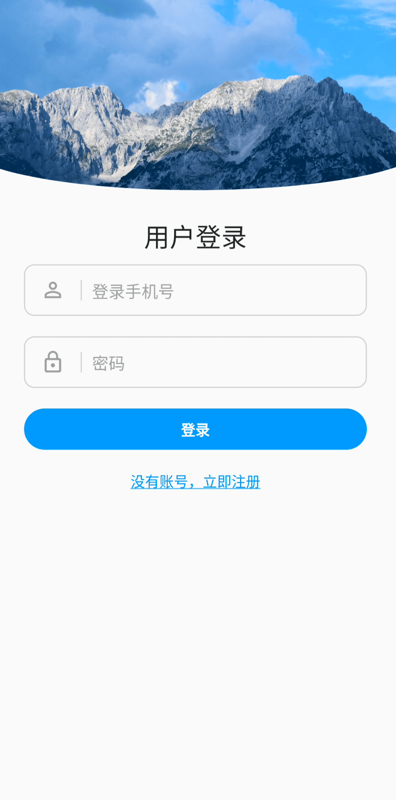

# 简介

用flutter来写的秒杀应用。

这是 [秒杀应用后端](https://github.com/weiraneve/seckillcloud)
的mobile端，这里还有[web端](https://github.com/weiraneve/seckill-front)
，以及[后台配置web](https://github.com/weiraneve/seckillcloud)

## 界面和功能

- 登录页面

- 注册界面

